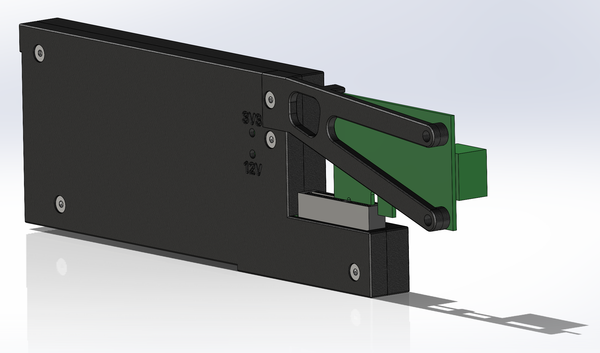

# hw-k2

This design provides a PCIe extender that converts from
a U.2 PCIe device connector and provides a x4 PCIe CEM slot.

This is designed to work on *our* gimlet computer sled with a 
sharkfin PCIe riser.  Whether this can be generally used in
other applications is unknown.

This repository includes a 3d-printable encolosure design that
fits in our sled and provides brackets for both of the commonly
used NICs.

[Mechanicals](mech_model)

# Status
The CAD represents a functional design.